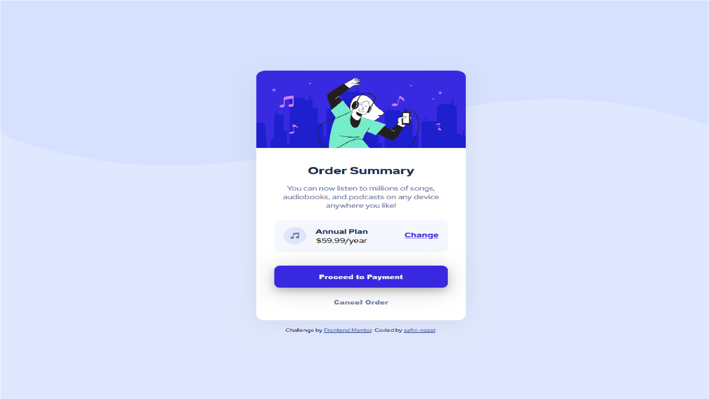

# Frontend Mentor - Order summary card solution

This is a solution to the [Order summary card challenge on Frontend Mentor](https://www.frontendmentor.io/challenges/order-summary-component-QlPmajDUj). Frontend Mentor challenges help you improve your coding skills by building realistic projects. 

## Overview

### Completed challenge

Users should be able to:

- See hover states for interactive elements

### Screenshot



### Links

- Live Site URL: [Add live site URL here](https://ordercard-sha.netlify.app/)

## My process

### Built with

- HTML5 markup
- CSS 
- Flexbox
- Desktop-first workflow


```html
<h1>Some HTML code I'm proud of myself😌❤</h1>
```

## Author

- Website - [Safni Nazar](https://linktr.ee/shafni50)
- Frontend Mentor - [@shafni50](https://www.frontendmentor.io/profile/shafni50)
